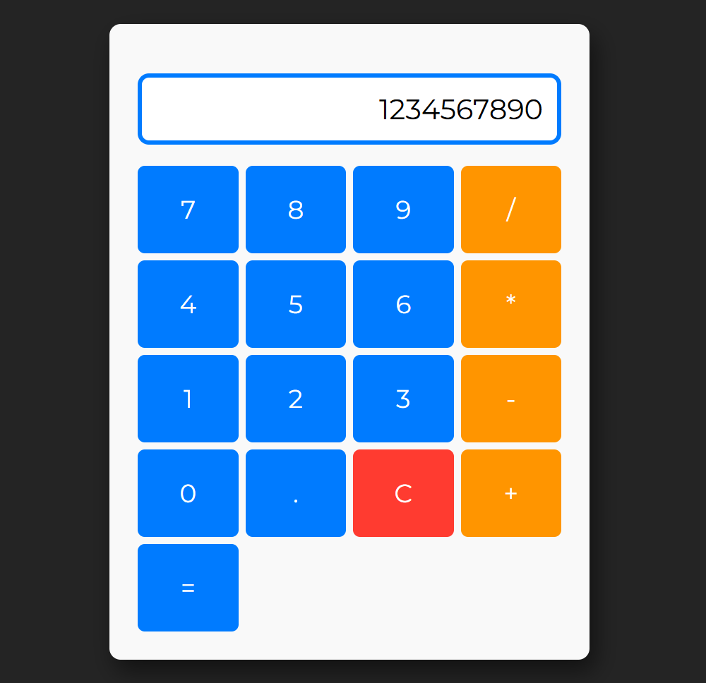

# 🧮 JS Calculator

Простой калькулятор на чистом JavaScript

_Интерфейс_

## 🛠 Технологии

- **HTML** - структура страницы
- **CSS** - стилизация и дизайн
- **JavaScript** - DOM manipulation и логика вычислений

## ✨ Функциональности

- Базовые арифметические операции (+, -, *, /)
- Обработка деления на ноль
- Очистка дисплея (кнопка C)
- Последовательные вычисления

## 🚀 Запуск

Откройте `index.html` в браузере